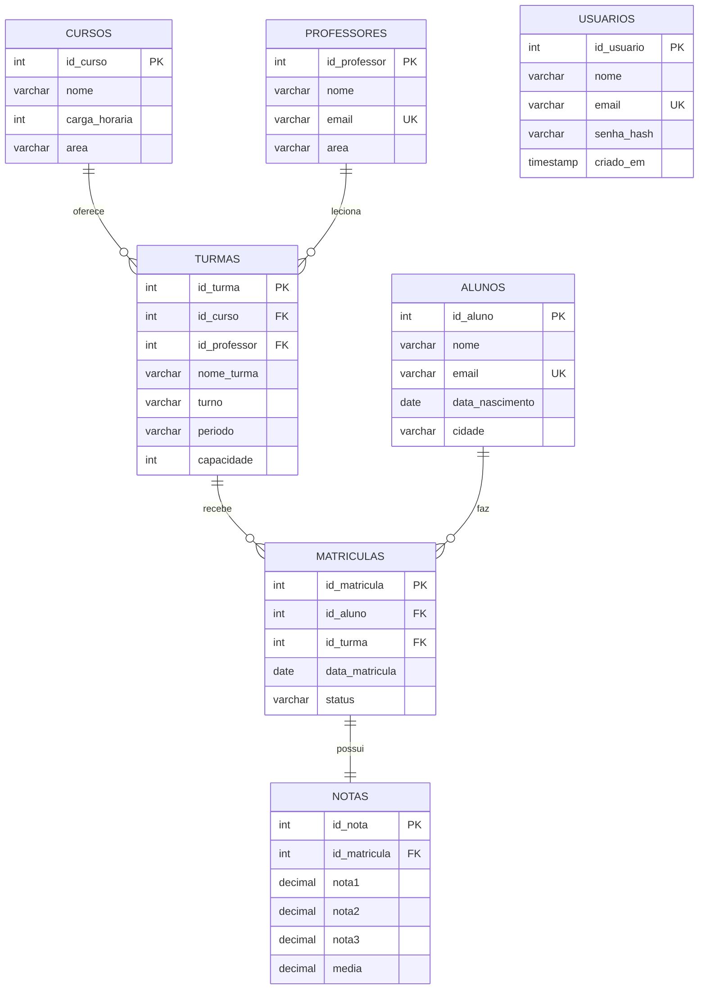

# DER — Diagrama Entidade-Relacionamento (`escola_db`)

Banco de dados relacional da instituição de ensino. Armazena professores,
cursos, turmas, alunos, suas matrículas e as notas de cada matrícula.
A tabela `usuarios` (login) é adicionada à parte pela aplicação.

## Diagrama (Mermaid)

## Relacionamentos

| Relacionamento              | Cardinalidade | Descrição                                   |
|-----------------------------|:-------------:|---------------------------------------------|
| `cursos` → `turmas`         | 1 : N         | Um curso é oferecido em várias turmas       |
| `professores` → `turmas`    | 1 : N         | Um professor leciona várias turmas          |
| `alunos` → `matriculas`     | 1 : N         | Um aluno pode ter várias matrículas         |
| `turmas` → `matriculas`     | 1 : N         | Uma turma possui várias matrículas          |
| `matriculas` → `notas`      | 1 : 1         | Cada matrícula tem um conjunto de notas     |

A tabela **matriculas** é a associativa que liga **alunos** e **turmas**
(relacionamento N:N), guardando também a data e o status da matrícula.
A **média final** já vem calculada na coluna `notas.media`.

> **usuarios** é independente das demais — guarda as credenciais da coordenação
> para o login. A senha é armazenada apenas como hash **bcrypt**.

## Como a tela usa os dados

| Campo exibido        | Origem no banco                    |
|----------------------|------------------------------------|
| Nome                 | `alunos.nome`                      |
| E-mail               | `alunos.email`                     |
| Matrícula            | `matriculas.id_matricula`          |
| Turma                | `turmas.nome_turma` (+ `cursos.nome`) |
| Data da matrícula    | `matriculas.data_matricula`        |
| Notas                | `notas.nota1`, `nota2`, `nota3`    |
| Média final          | `notas.media`                      |

## Dicionário de dados

### professores
| Coluna       | Tipo         | Restrições         |
|--------------|--------------|--------------------|
| id_professor | INT          | PK                 |
| nome         | VARCHAR(100) | NOT NULL           |
| email        | VARCHAR(120) | NOT NULL, UNIQUE   |
| area         | VARCHAR(80)  | NOT NULL           |

### cursos
| Coluna        | Tipo         | Restrições |
|---------------|--------------|------------|
| id_curso      | INT          | PK         |
| nome          | VARCHAR(120) | NOT NULL   |
| carga_horaria | INT          | NOT NULL   |
| area          | VARCHAR(80)  | NOT NULL   |

### turmas
| Coluna       | Tipo        | Restrições                          |
|--------------|-------------|-------------------------------------|
| id_turma     | INT         | PK                                  |
| id_curso     | INT         | FK → cursos(id_curso)               |
| id_professor | INT         | FK → professores(id_professor)      |
| nome_turma   | VARCHAR(60) | NOT NULL                            |
| turno        | VARCHAR(20) | NOT NULL (Manhã/Tarde/Noite)        |
| periodo      | VARCHAR(20) | NOT NULL (ex.: 2026.1)              |
| capacidade   | INT         | NOT NULL                            |

### alunos
| Coluna          | Tipo         | Restrições         |
|-----------------|--------------|--------------------|
| id_aluno        | INT          | PK                 |
| nome            | VARCHAR(100) | NOT NULL           |
| email           | VARCHAR(120) | NOT NULL, UNIQUE   |
| data_nascimento | DATE         |                    |
| cidade          | VARCHAR(80)  | NOT NULL           |

### matriculas
| Coluna         | Tipo        | Restrições                     |
|----------------|-------------|--------------------------------|
| id_matricula   | INT         | PK                             |
| id_aluno       | INT         | FK → alunos(id_aluno)          |
| id_turma       | INT         | FK → turmas(id_turma)          |
| data_matricula | DATE        | NOT NULL                       |
| status         | VARCHAR(20) | NOT NULL (Ativa/Concluída)     |

### notas
| Coluna       | Tipo         | Restrições                     |
|--------------|--------------|--------------------------------|
| id_nota      | INT          | PK                             |
| id_matricula | INT          | FK → matriculas(id_matricula)  |
| nota1        | DECIMAL(4,2) | NOT NULL                       |
| nota2        | DECIMAL(4,2) | NOT NULL                       |
| nota3        | DECIMAL(4,2) | NOT NULL                       |
| media        | DECIMAL(4,2) | NOT NULL                       |

### usuarios *(adicionada pela aplicação — `sql/usuarios.sql`)*
| Coluna     | Tipo         | Restrições                |
|------------|--------------|---------------------------|
| id_usuario | INT          | PK, AUTO_INCREMENT        |
| nome       | VARCHAR(120) | NOT NULL                  |
| email      | VARCHAR(120) | NOT NULL, UNIQUE          |
| senha_hash | VARCHAR(255) | NOT NULL (bcrypt)         |
| criado_em  | TIMESTAMP    | DEFAULT CURRENT_TIMESTAMP |
