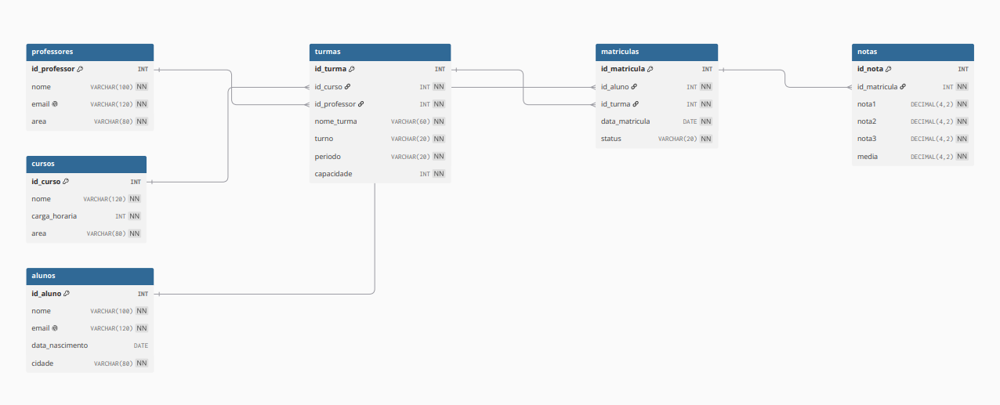

# Projeto Final — Módulo 09: Banco de Dados e SQL
## Capacitação em Desenvolvimento Full Stack | Grupo 4
**Professor:** Janei Vieira Pereira

Este repositório contém a entrega do Projeto Integrador correspondente ao encerramento do ciclo de Banco de Dados. O projeto consiste em uma aplicação web funcional integrada à base de dados `escola_db`, desenvolvida para simular o atendimento a uma solicitação real de negócio realizada por um *Product Owner*.

---

## 👥 Integrantes e Divisão de Responsabilidades

Para atender às diretrizes do papel de equipe, dividimos nosso grupo nas seguintes frentes técnicas:

* **Equipe de Desenvolvimento: (Back-End)**
    * [Paulo Mesquita]() - *Responsável pela configuração do servidor local, roteamento da API e estruturação das consultas SQL (JOINs) para extrair os dados da base escola_db.*
    * [Álefe Alves](https://github.com/AlefeAlvesC) — *Responsável pela conexão segura entre a aplicação web e o banco de dados MySQL, além de gerenciar as variáveis de ambiente.*
    * [Luciano dos Santos](https://github.com/luciano-cc-dev) — *Responsável por criar a lógica de negócios dos filtros dinâmicos por turma e os endpoints de pesquisa por nome do aluno.*
    * [Felipe Spínola]() — *Responsável pela conexão segura entre a aplicação web e o banco de dados MySQL, além de gerenciar as variáveis de ambiente.*
* **Equipe de Desenvolvimento: (Front-End)**
    * [Amanda Barbosa](https://github.com/amandaabarbosa98) — *Responsável pelo design e estruturação da interface do usuário, desenvolvendo a tabela principal de exibição dos dados acadêmicos.*
    * [Leonam Souza]() — *Responsável por implementar a barra de busca por nome e o componente de seleção (select) para filtragem por turma de forma dinâmica.*
    * [Edson Felipe]() — *Responsável pela integração do frontend com as rotas do backend, garantindo o consumo correto dos dados em tempo real*
    * [Álefe Alves](https://github.com/AlefeAlvesC) — *Responsável pela estilização responsiva do sistema e por criar o destaque visual personalizado para as médias aprovadas e baixas.*

---

## 📐 Modelagem e Banco de Dados (`escola_db`)

O banco de dados do projeto foi estruturado a partir do arquivo padrão fornecido, mapeando todo o ecossistema escolar através de 6 tabelas principais correlacionadas por chaves estrangeiras:

### 1. Diagrama de Entidade-Relacionamento (DER)



### 2. Dicionário de Dados Resumido
* **`professores`:** Armazena o corpo docente, e-mails institucionais e áreas de atuação.
* **`cursos`:** Catálogo contendo as cargas horárias e áreas de cada curso.
* **`turmas`:** Tabela intermediária que gerencia os turnos, períodos e capacidades de vagas, vinculando cursos e professores.
* **`alunos`:** Cadastro pessoal dos discentes com suas respectivas cidades de origem.
* **`matriculas`:** Entidade que conecta o aluno a uma turma, controlando o status atual (Ativa / Concluída).
* **`notas`:** Guarda as 3 notas parciais do aluno e armazena de forma persistente a média final calculada.

---

## 💻 A Aplicação Web

Conforme o escopo obrigatório solicitado pelo PO, a aplicação foca puramente em consultas rápidas para uso do corpo de coordenação acadêmica, trazendo os seguintes recursos:

### Itens Obrigatórios Implementados:
* Visualização clara contendo: Nome do Aluno, E-mail, Turma, Data de Matrícula, Notas parciais (`nota1`, `nota2`, `nota3`) e Média Final.
* Filtro de listagem dinâmica por Turma.
* Barra de pesquisa de estudantes por Nome.

---

## 🚀 Arquitetura e Como Executar o Projeto

**Tecnologias Utilizadas:**
* **Backend:** (Ex: Node.js / Express, Python / Flask - Preencher aqui)
* **Frontend:** (Ex: React, HTML/CSS/JS puro - Preencher aqui)
* **Banco de Dados:** MySQL / SGBD Relacional

**Instruções para Execução Local:**
1. **Clone o repositório:**
   ```bash
   git clone https://github.com/AlefeAlvesC/bancos-de-dados-e-sql.git

2. **Suba o banco de dados: Execute o script SQL fornecido**
(base_escola_db_humana.sql) no seu ambiente MySQL local para criar e popular o banco escola_db.

3. **Configure as variáveis de ambiente:**
Criar as credenciais de acesso ao banco no arquivo de configuração da aplicação (.env ou equivalente).

4. **Inicie o servidor:**
   ```bash
   npm install && npm start  # (Ou o comando correspondente da sua tecnologia)

***Projeto desenvolvido pelo Grupo 4 para o Módulo 9 de Desenvolvimento Full Stack — 2026.***